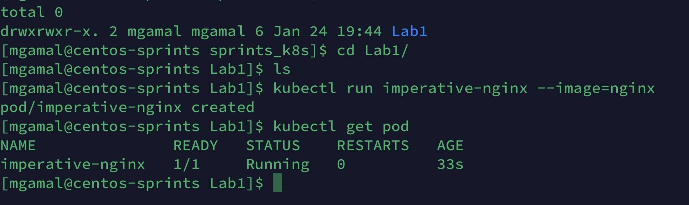
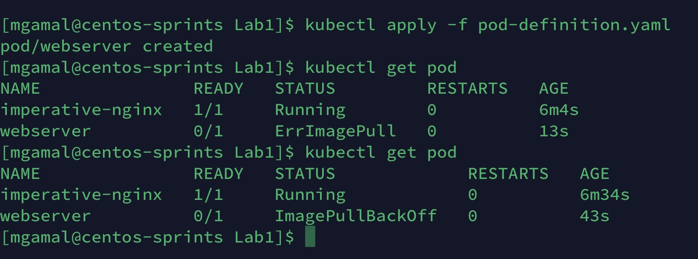
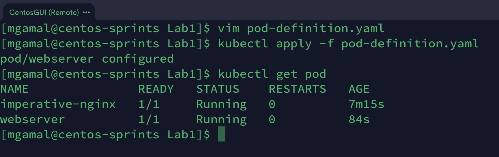
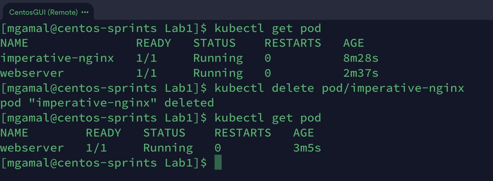
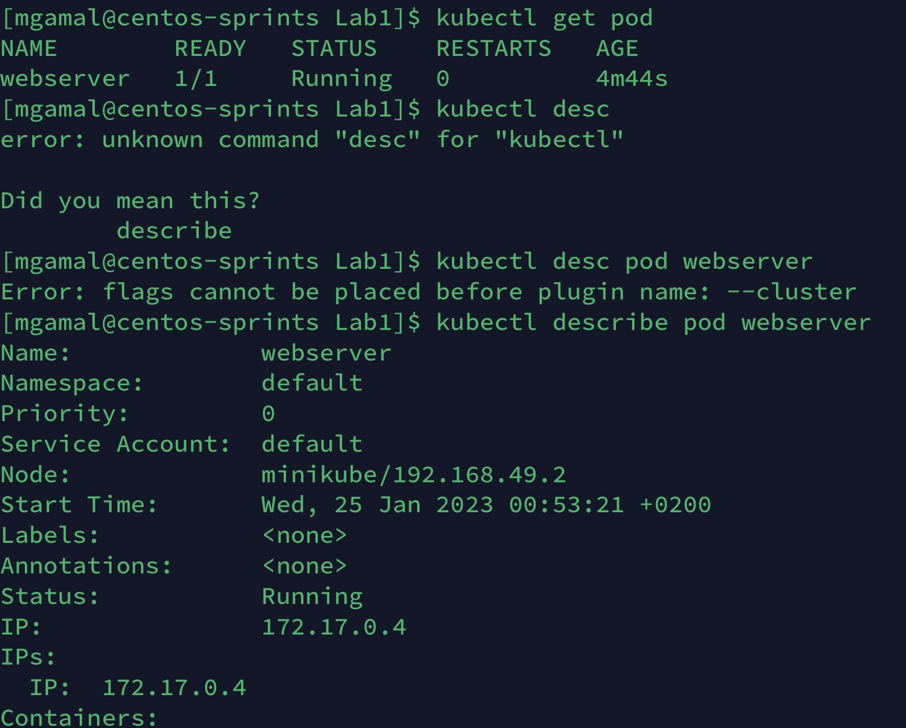
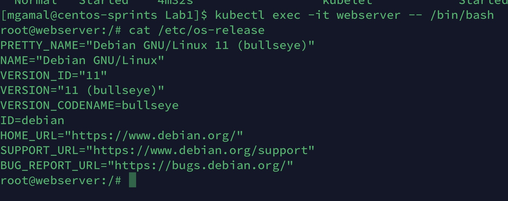
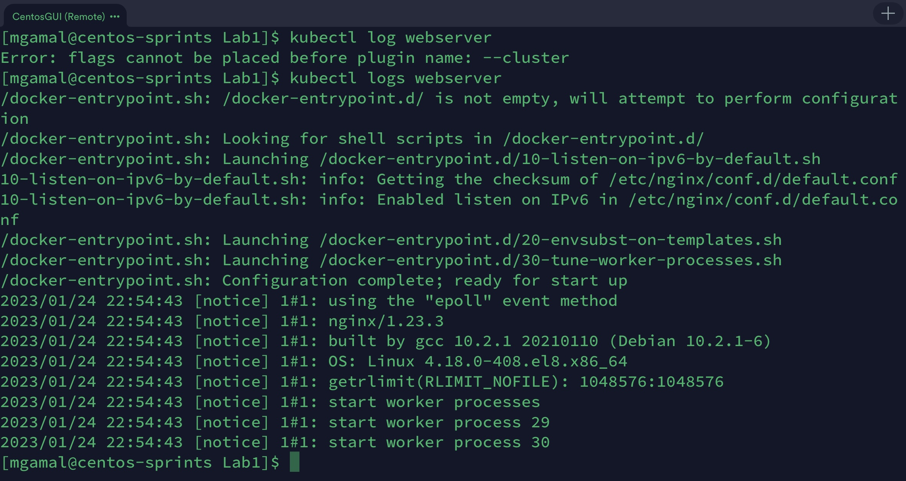
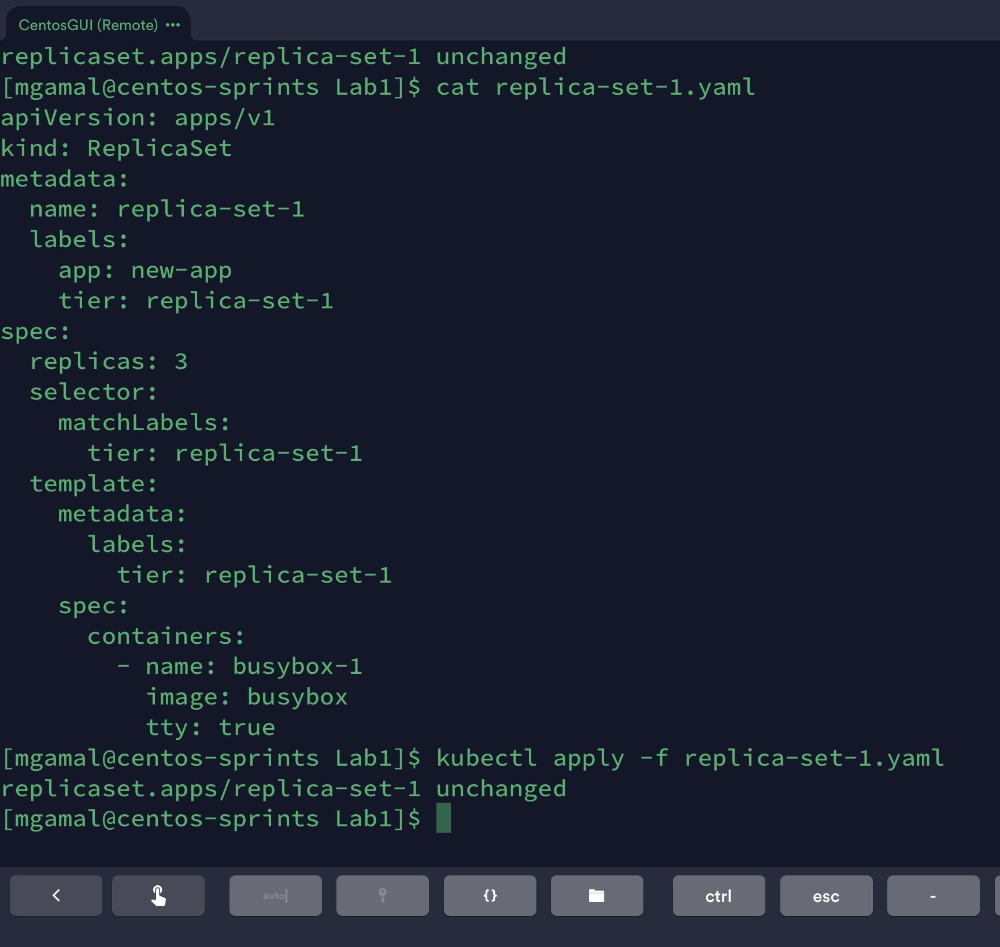
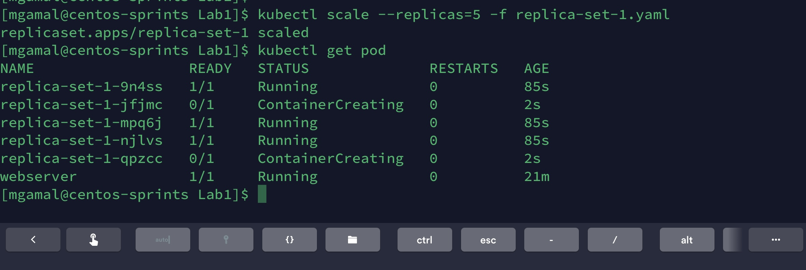
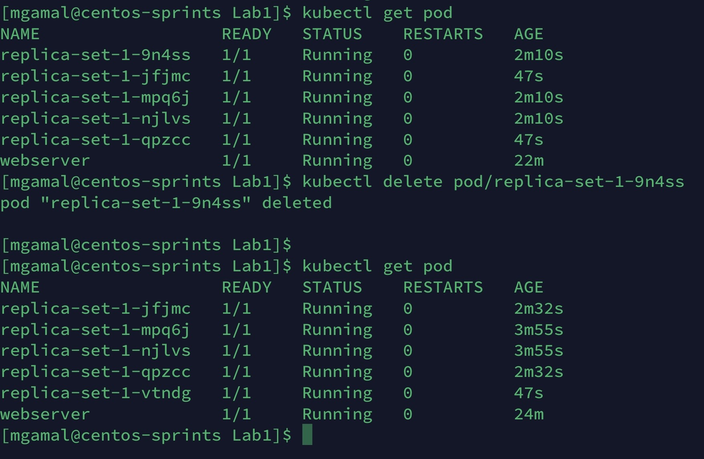

### 01- Create a pod with the name “imperative-nginx” and with the image nginx and latest tag. using Imperative command (not yaml).

---

### 02- Create a pod with the name webserver and with the image “nginx123”Use a pod-definition YAML file.
### 03- What is the nginx pod status?

---

### 04- Change the nginx pod image to “nginx” check the status again

---

### 06- What does READY column in the output of get pods command indicate?
####  The `Ready` indicates the readiness of containers in each pod, since some pods start faster than other 

---

### 05- How many pods are running in the system? Type the command to show this
### 07- Delete first pod named imperative-nginx you just created. Type the command to do this

---

### 08- Which node is pod named webserver running on (list two commands to do this)

---

### 09- Get a shell to the running container i.e ssh into it (figure out the command)
### 10- Run cat /etc/os-release inside the container
### 11- Exit from the shell (/bin/bash) session

---

### 12- Get logs of pod, what are logs and what they are used for?

---

### 13- How many ReplicaSets exist on the system?
####  None 
---

### 14- create a ReplicaSet withname= replica-set-1 image= busybox replicas= 3

---

### 15- Scale the ReplicaSet replica-set-1 to 5 PODs.

---

### 16- How many PODs are READY in the replica-set-1?
### 17- Delete any one of the 5 PODs then check How many PODs exist now? Why are there still 5 PODs, even after you deleted one?

