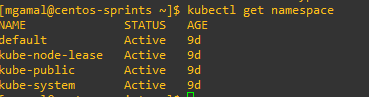
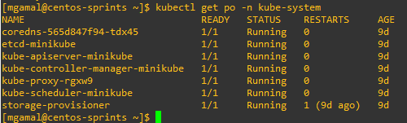
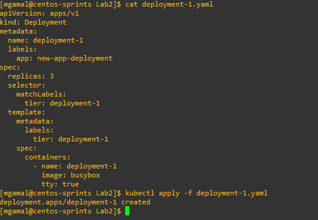
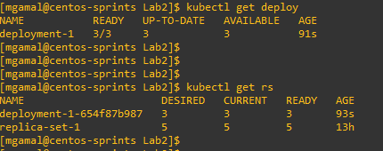
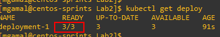
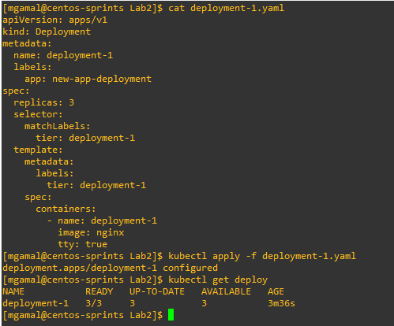
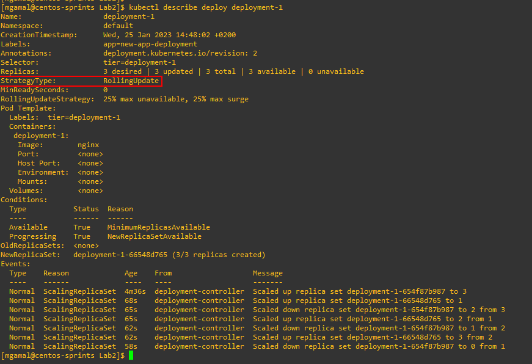
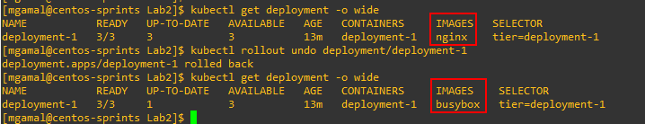
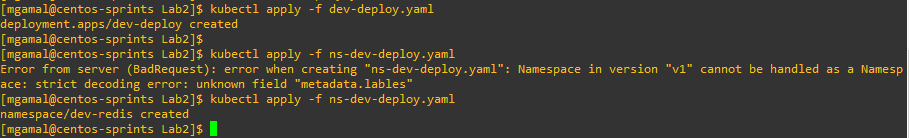

### 01- How many Namespaces exist on the system?


---

### 02-How many pods exist in the kube-system namespace?


---

### 03- create a Deployment with
``` 
name= deployment-1
image= busybox
replicas= 3
```


---


### 04- How many Deployments and ReplicaSets exist on the system now?


---

### 05- How many pods are ready with the deployment-1?


---

### 06- Update deployment-1 image to nginx then check the ready pods again


---

### 07- Run kubectl describe deployment deployment-1 and check events, What is the deployment strategy used to upgrade the deployment-1?


---

### 08- Rollback the deployment-1 What is the used image with the deployment-1?
### 09- What is the used image with the deployment-1?


--- 

### 10- Create a deployment with
```
Name: dev-deploy
Image: redis
Replicas: 2
Namespace: dev
Resources Requests:
CPU: .5 vcpu
Mem: 1G
Resources Limits:
CPU: 1 vcpu
Mem: 2G
```

