## 01) What is Jenkins used for?
#### Jenkins is an open source CI/CD automation software, used to implement pipelines that automate the workflow; by detecting defects in code base, build the siftware, automate build test and deliver code base for deployment.
---

## 02) What is Jenkins agent? What is Jenkins executor (Build Executor)?
#### Jenkins Agent is is a worker node that executes your code (all steps included in a Jenkins job).

#### Example of Agents: Python, Maven, Gradle, and a lot more.

---

## 03) Explain Jenkins master-slave architecture?
#### Jenkins Master: Is the main Jenkins server is the brain, which contain all system configurations, plugins, credentials, Jobs & piplelines.

#### Jenkins Slave: Is the worker node is the muscle, that is used by the Master to execute code in created jobs.

---

## 04) Install jenkins with docker image.

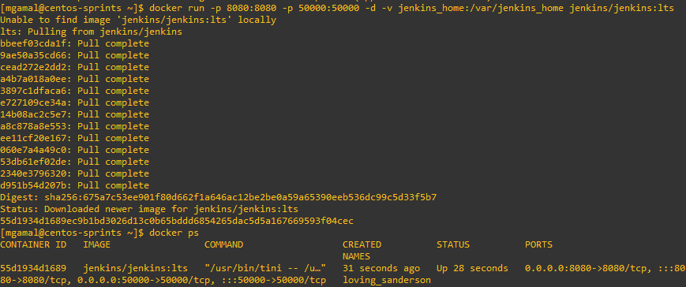

---
---

## 05) Create free style project and link it to private git repo containing any dockerfile then biuld an image from this dockerfile and push it to private docker repo
 

#### Project Name

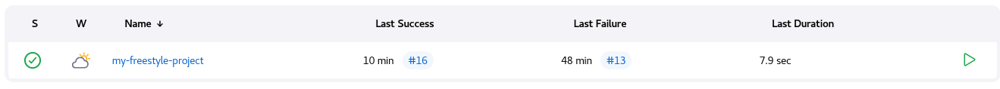

 

#### Github credentials

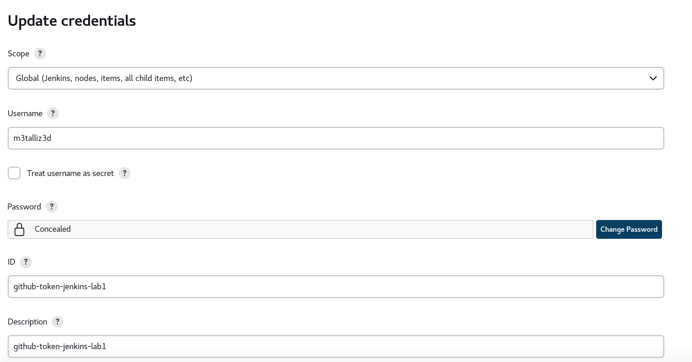

 

#### docker hub credentials

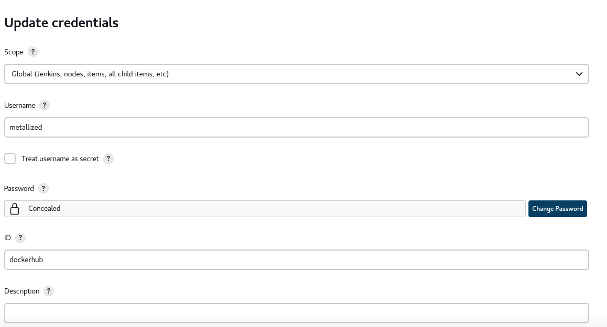

 

#### Configuring github creds for github

 

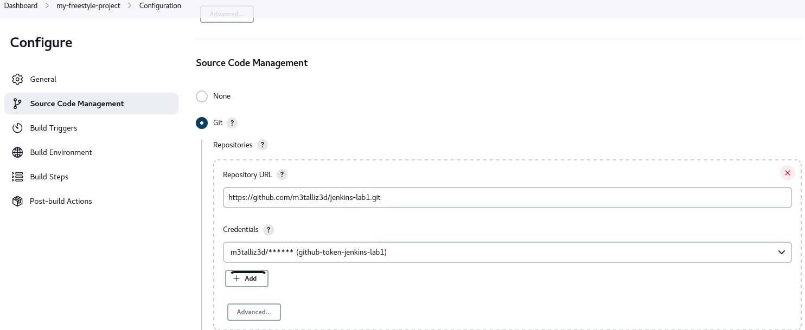

#### Configuring github creds for dockerhub

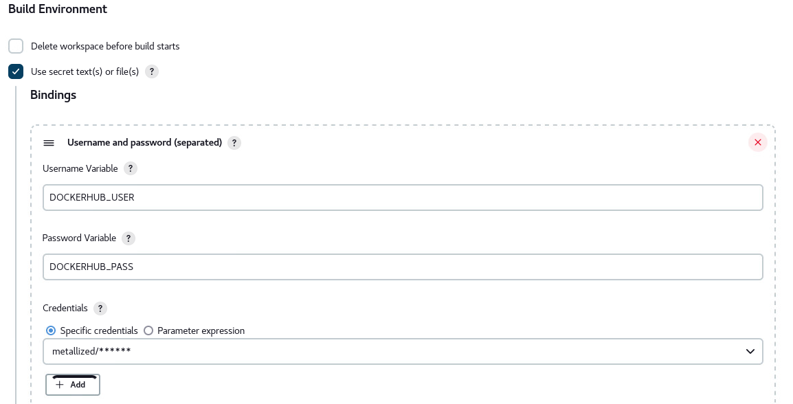

 

#### Repo imported from swelam repo

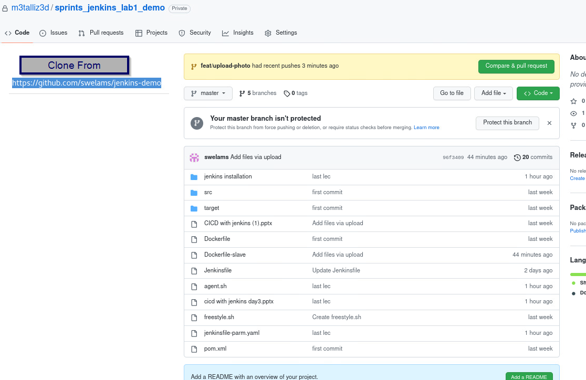

 

#### Private dockerhub repo (empty)

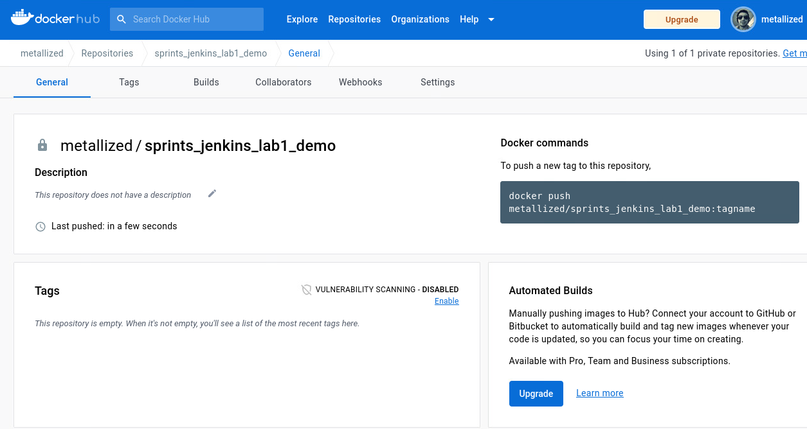

 

#### jenkins excuteshell commands used for build.

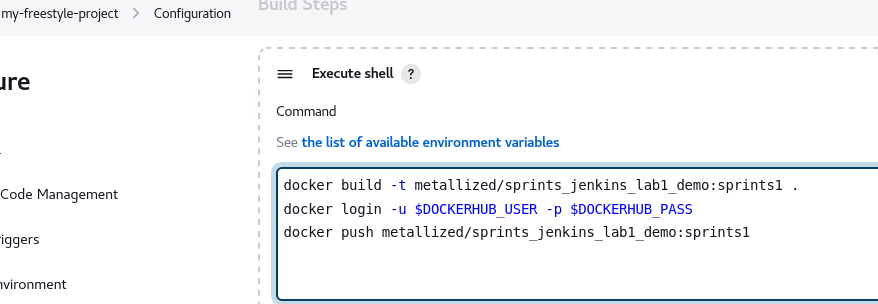

 

#### Console output of pull

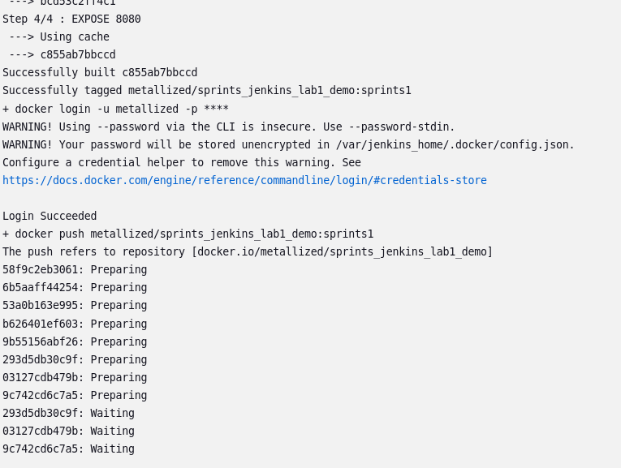

 

#### Console output of push and success build on jenkins.

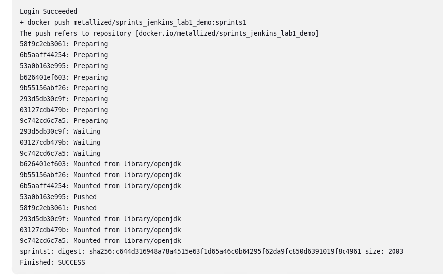

 

#### First image pushed to DockerHub repo

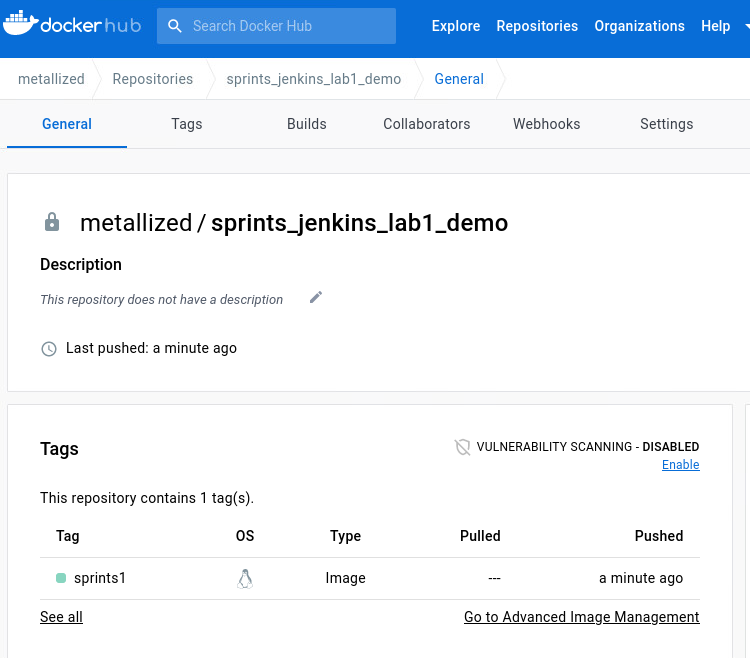

 

#### Second verdion of first image pushed to DockerHub repo

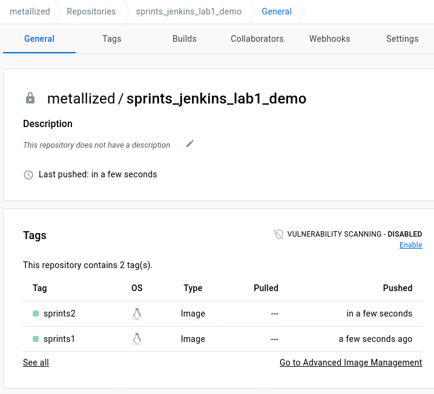