## 1) What is Jenkins pipeline?
#### Jenkins pipeline is a process where developers are able to implement and integrate continuous integration pipelines in Jenkins.
 

---
 

## 02) What scripting language is Jenkins pipeline syntax based on?
#### Groovy Programming Language 

 

---

 

## 03) What are the ways you can write pipeline in Jenkins?
### A Jenkinsfile can be written using two types of syntax - Declarative and Scripted.
 

---

 

## 04) Create Jenkins pipeline for your repo and use script file (jenkinsfile) to write pipeline syntax ? 

 

### Pipline

  

### cresentials used to access GitHub Repo
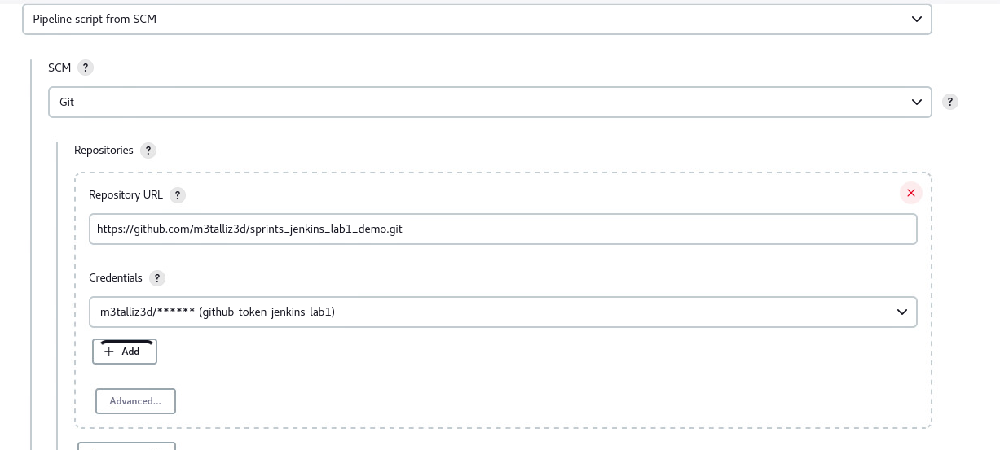
  

### File that will used to find and build
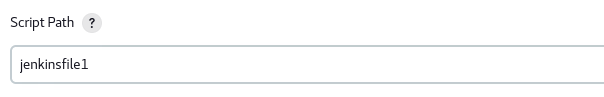
  

### jenkinsfile script
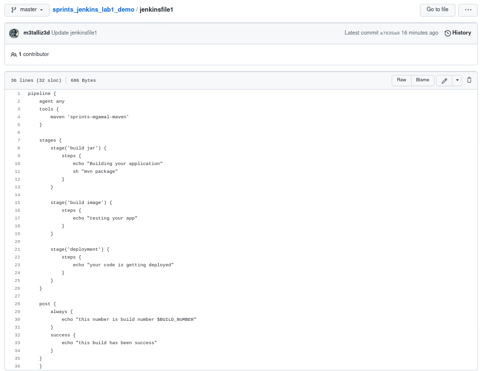
  

### build performed
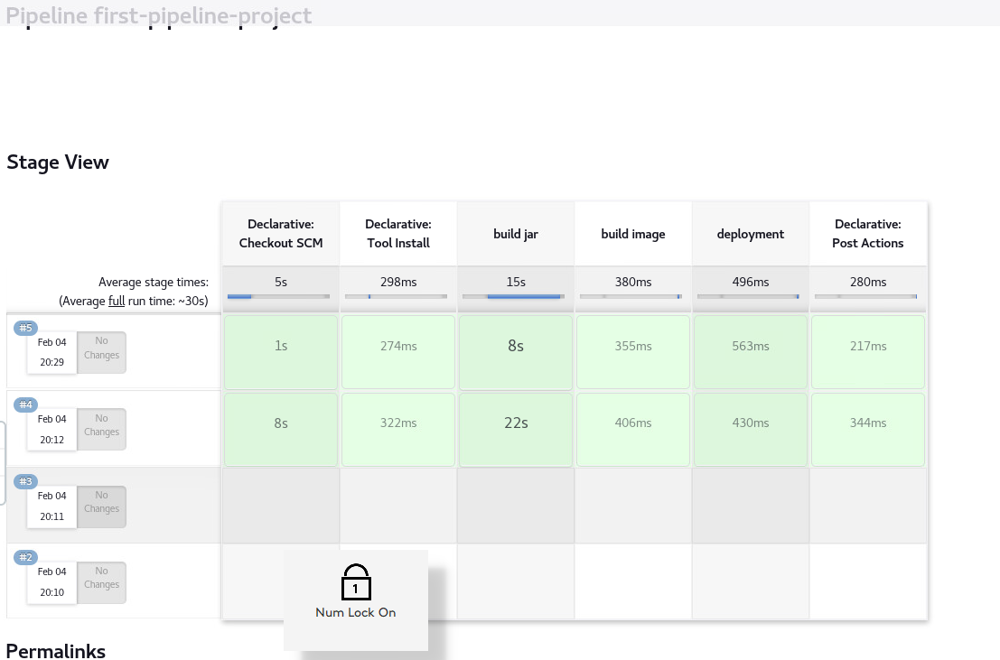
  

### Output-1
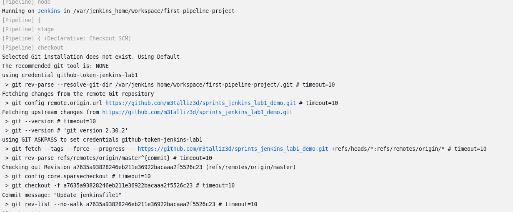
  

### Output-2 (cont)
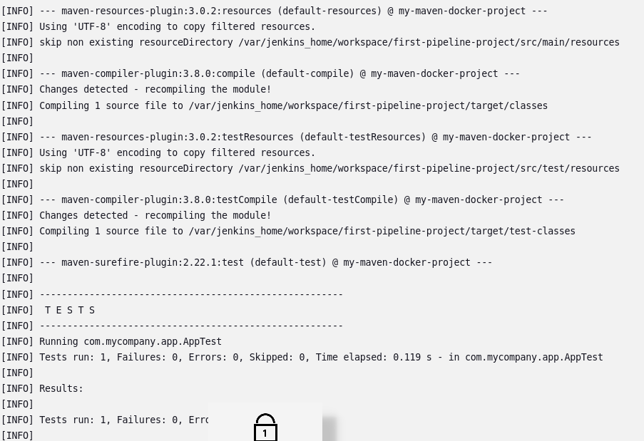
  

### Output-3 (cont)
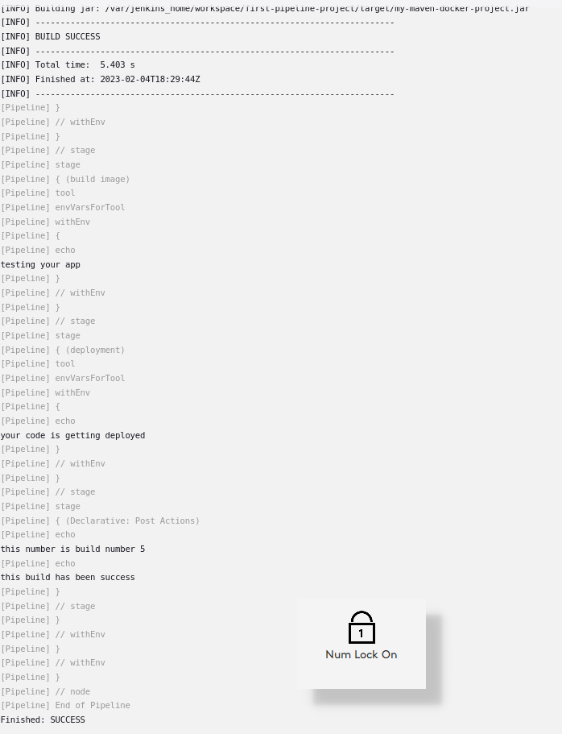

---
 

---
  
## 05) Create another multi-branch pipeline and filter branches to contain only (master , dev , test ) ? 
 

### Pipline name (mutli-branch)
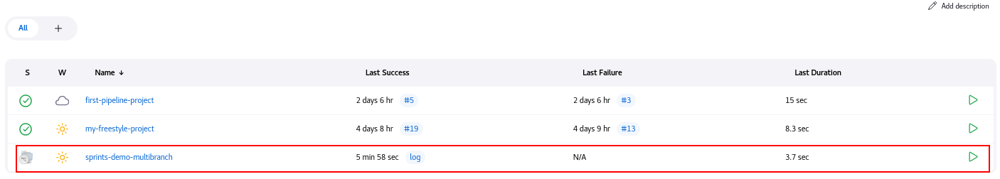
  

### multi-branch config
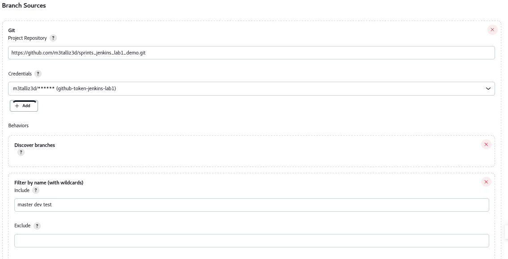
  

### detect specific branches on GitHub
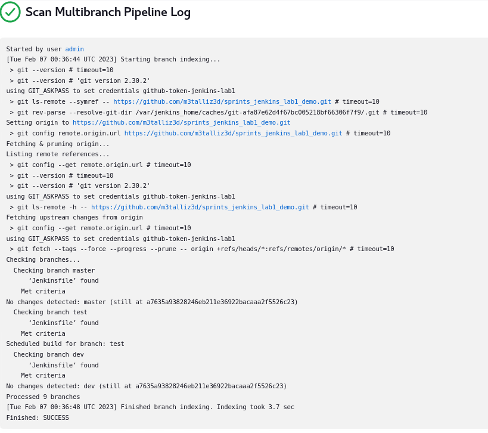
  

### Showing detected branches
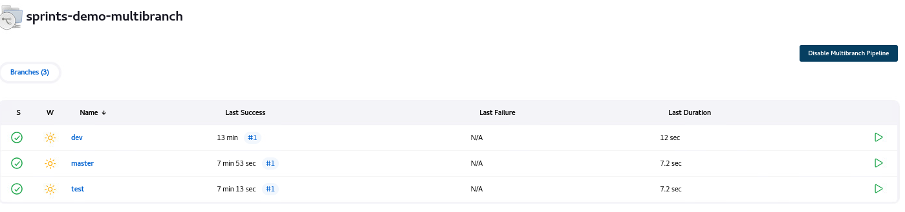
  

### Branches available on Github
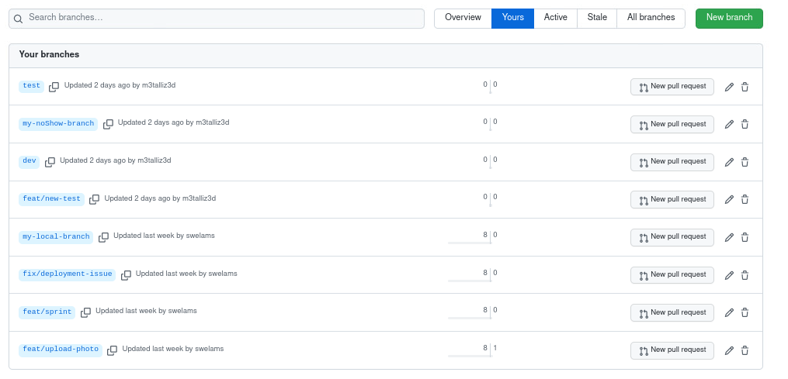
  

### dev-build "build"
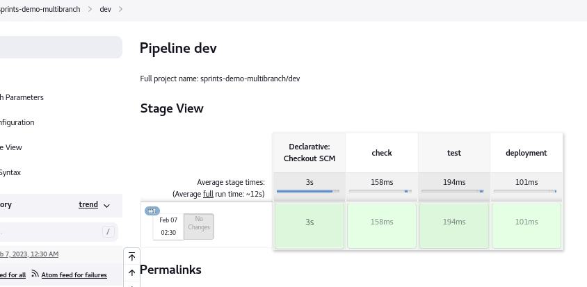
  

### stage-build "build"
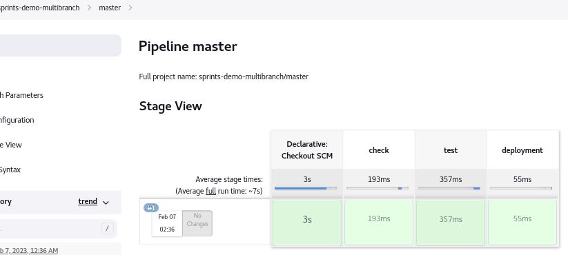
  
### test-build "build"

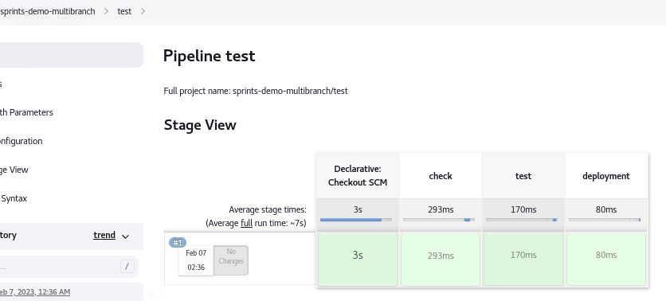
