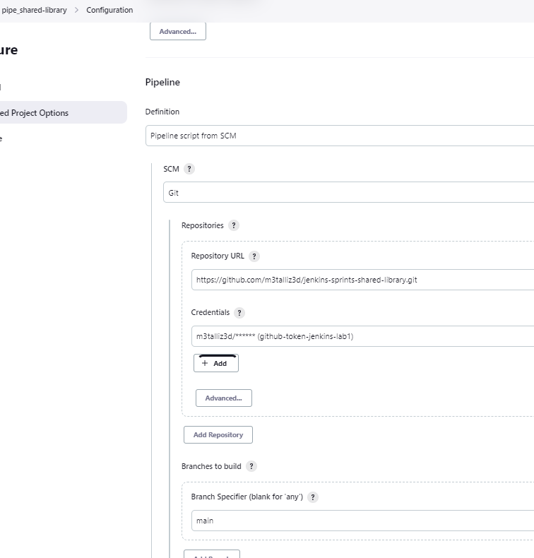

# Jenkins Lab3

## Q1: 
1. Manual Trigger: You can manually trigger a pipeline from the Jenkins UI by clicking on the "Build Now" button. This will immediately start the pipeline.

2. Scheduled Trigger: You can schedule a pipeline to run at a specific time using the "Build periodically" option. This can be useful if you want to run the pipeline at a specific time, such as every day at a certain time.

3. SCM Trigger: You can configure Jenkins to trigger a pipeline automatically when changes are made to the source code repository. This is called an SCM (source code management) trigger. Jenkins supports a variety of SCM systems, including Git, SVN, and Mercurial.

4. Webhook Trigger: If your source code repository supports webhooks, you can configure Jenkins to listen for webhook events and trigger a pipeline when a webhook is received. This can be a more efficient way to trigger pipelines than using an SCM trigger, since Jenkins doesn't have to constantly poll the repository for changes.

5. Remote Trigger: You can trigger a pipeline remotely using the Jenkins API. This can be useful if you want to trigger a pipeline from a script or another application.

6. Pipeline Trigger: You can trigger another pipeline from within a pipeline using the "build" step. This can be useful if you have a pipeline that depends on the output of another pipeline, or if you want to run multiple pipelines in parallel.

---

## Q2: 
Jenkins master-slave architecture, also known as Jenkins distributed architecture, allows you to distribute the build and test workload across multiple nodes or agents, which can help you to achieve better scalability, reliability, and performance compared to building everything on the Jenkins master node.

---

## Q3: 
- Authentication is the process of verifying the identity of a user, device, or system. It ensures that the person or system attempting to access a resource is who they claim to be. Authentication is typically achieved by requiring the user to provide some form of credentials, such as a username and password, a smart card, or a biometric factor like a fingerprint or face recognition.

- Authentication is the process of verifying the identity of a user, device, or system. It ensures that the person or system attempting to access a resource is who they claim to be. Authentication is typically achieved by requiring the user to provide some form of credentials, such as a username and password, a smart card, or a biometric factor like a fingerprint or face recognition.

---

## Q4: 
In Jenkins, an organization job is a job that defines a set of jobs to be run on a set of agents based on a particular pattern. The primary benefit of using organization jobs in Jenkins is that they help to streamline the process of managing and executing jobs across a large number of agents and environments.

---

### [Shared Library Repo used in Q5](https://github.com/m3talliz3d/jenkins-sprints-shared-library)

---

## Q5: make jenkins-shared-library and make your jenkinsfile which you used in lab2 to point to this library

### Pipeline Name

### Global pipeline configuration to point to groovy files on a Repo

### Pipeline Configuration

### GitHub Repo used for Shared Libraries

### DockerHub Login file in "vars" file

### Pipeline Output 1

### Pipeline Output 2

---
## 
 Bonus 
 
---

### Running Build on Node

### Build with slave instance

### Build with slave instance (Output 1)

### Build with slave instance (Output 2)

